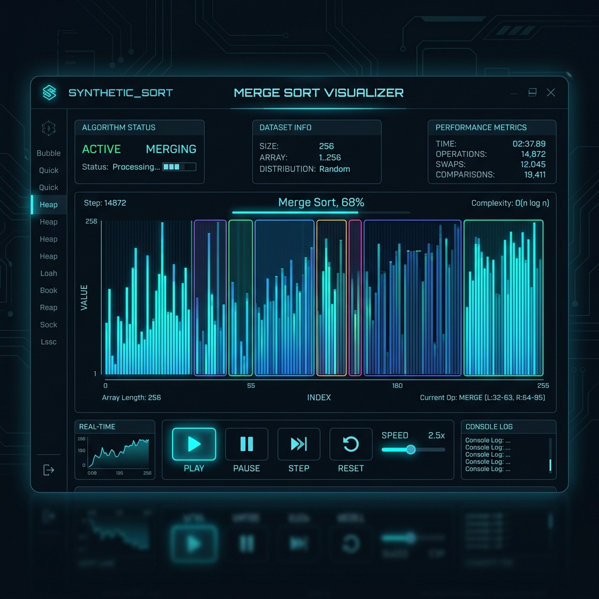
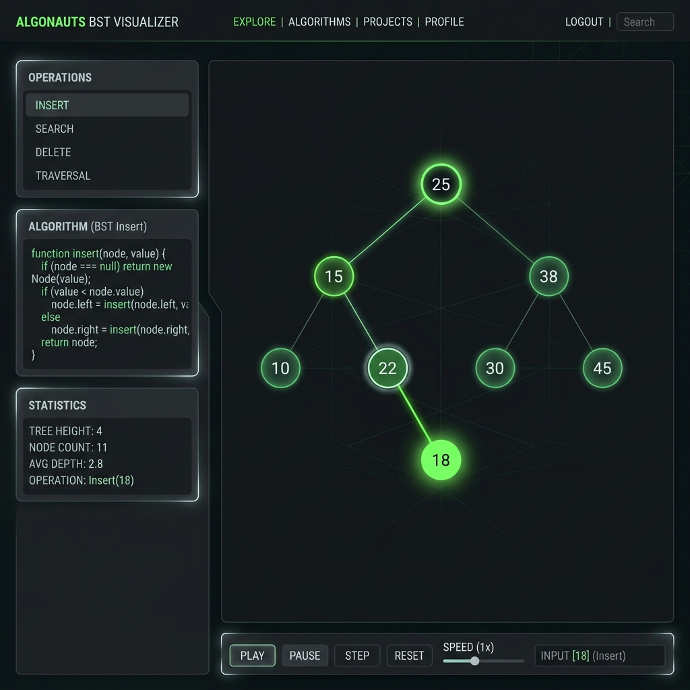
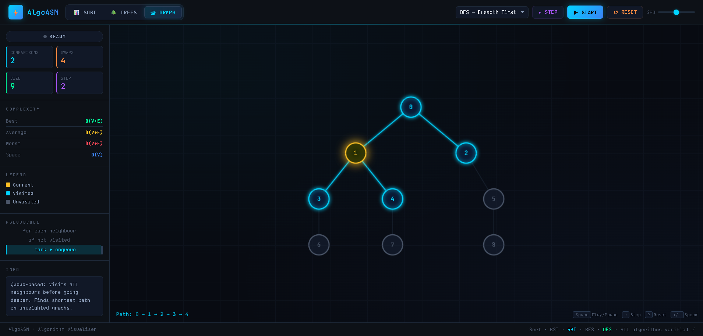

<div align="center">
  
  
  # ⚡ AlgoASM
  
  **Un Visualiseur d'Algorithmes Moderne et Interactif**

  [](https://developer.mozilla.org/en-US/docs/Web/HTML)
  [](https://developer.mozilla.org/en-US/docs/Web/CSS)
  [](https://developer.mozilla.org/en-US/docs/Web/JavaScript)
  [](https://opensource.org/licenses/MIT)

  [Fonctionnalités](#-fonctionnalités-principales) •
  [Installation](#-installation--lancement) •
  [Raccourcis](#️-raccourcis-clavier)
</div>

---

## 📖 À Propos du Projet

**AlgoASM** est une application web interactive conçue pour visualiser de manière dynamique les algorithmes fondamentaux en informatique. Doté d'une interface très moderne (Dark Mode / Néon), ce projet permet de comprendre intuitivement et visuellement le fonctionnement des algorithmes de tri, des structures d'arbres et de graphes.

**Auteurs :** Reda Ganoutre & Youssef Elmeliani

---

## 🎬 Démonstration (Animation)

> **Astuce :** Vous pouvez enregistrer une petite vidéo ou GIF de l'interface et la placer dans `assets/demo.gif` pour qu'elle s'affiche ici !

<div align="center">
  
</div>

---

## 🌟 Fonctionnalités Principales

### 📊 1. Algorithmes de Tri (Sorting)
Visualisez en temps réel les échanges et comparaisons des éléments d'un tableau.
* **Tri à bulles** (Bubble Sort)
* **Tri par sélection** (Selection Sort)
* **Tri par insertion** (Insertion Sort)
* **Tri rapide** (Quick Sort)
* **Tri fusion** (Merge Sort)

<div align="center">
  
  <p><i>Aperçu du mode Tri (Sorting)</i></p>
</div>

### 🌳 2. Structures d'Arbres (Trees)
Construisez des arbres dynamiquement avec des animations fluides des nœuds et des branches.
* **Arbre binaire de recherche** (BST - Binary Search Tree)
* **Arbre Rouge-Noir** (RBT - Red-Black Tree) avec gestion des rotations et équilibrage.

<div align="center">
  
  <p><i>Aperçu du mode Arbres (Trees)</i></p>
</div>

### 🕸️ 3. Graphes (Graphs)
Visualisez la découverte et l'exploration des nœuds.
* **Parcours en largeur** (BFS - Breadth-First Search)
* **Parcours en profondeur** (DFS - Depth-First Search)

<div align="center">
  
  <p><i>Aperçu du mode Graphes (Graphs)</i></p>
</div>

---

## ⚙️ Statistiques & Suivi en temps réel

Pendant l'exécution d'un algorithme, le tableau de bord latéral offre des informations précises :
- 📈 **Compteurs :** Nombre exact de comparaisons et d'échanges.
- ⏱️ **Complexité :** Affiche la complexité théorique Temporelle (Meilleur, Moyen, Pire cas) et Spatiale.
- 💻 **Pseudo-Code Actif :** Suivi ligne par ligne du code source en direct avec l'animation.

---

## 🚀 Installation & Lancement

L'application est codée de manière native (**Vanilla JS/CSS**). Aucune installation complexe n'est requise !

1. **Clonez le dépôt :**
   ```bash
   git clone https://github.com/votre-nom/AlgoASM.git
   ```
2. **Lancez l'application :**
   Ouvrez simplement le fichier `index.html` dans n'importe quel navigateur web moderne.

---

## ⌨️ Raccourcis Clavier

Pour une expérience utilisateur parfaite, vous pouvez utiliser votre clavier :

| Touche | Action |
| :--- | :--- |
| `Espace` | Lecture / Pause de l'animation |
| `Flèche Droite (→)` | Avancer d'une seule étape |
| `R` | Réinitialiser les données courantes |
| `+` / `-` | Modifier la vitesse de l'animation |

---

<div align="center">
  <p>Fait  par Reda & Youssef</p>
</div>
